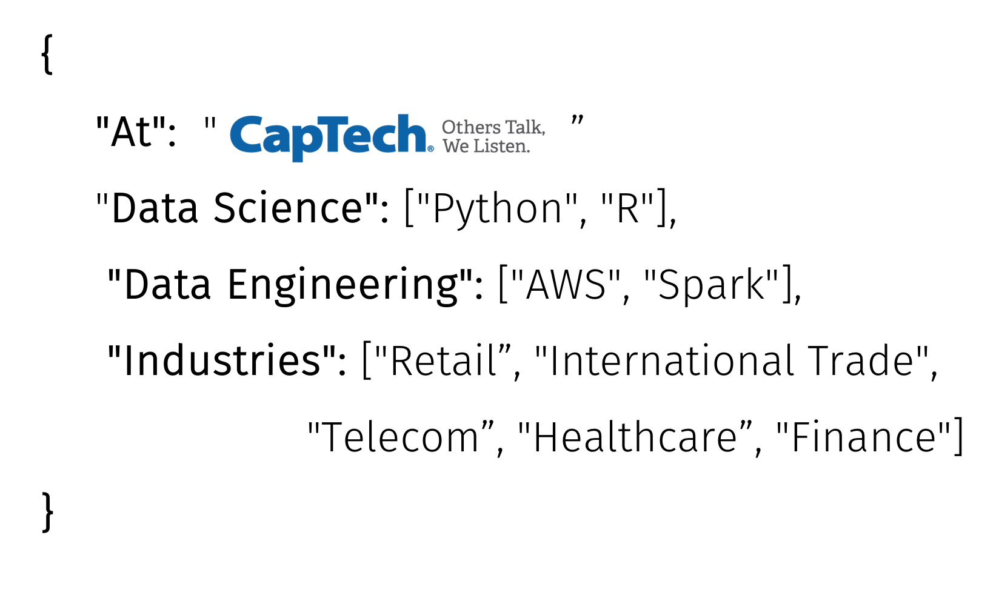
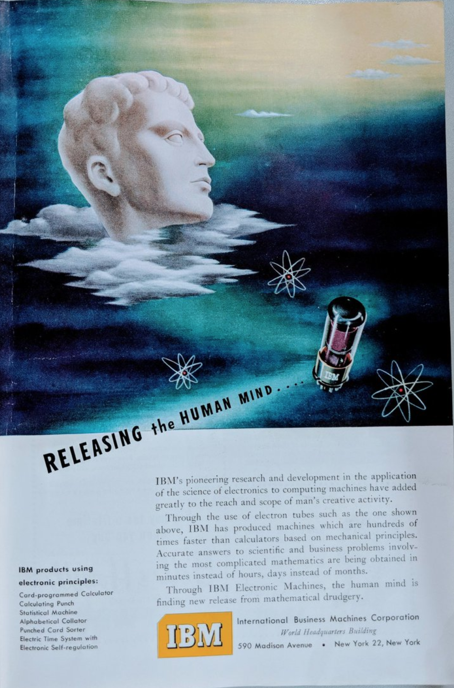
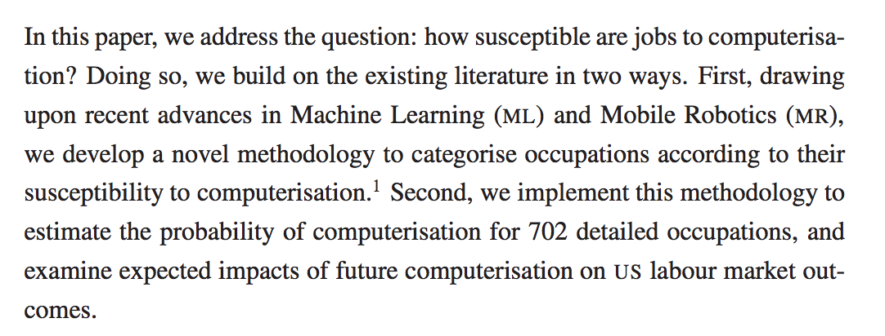
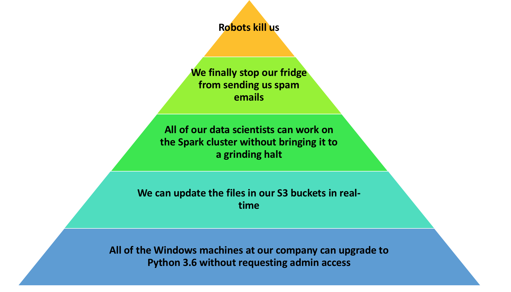
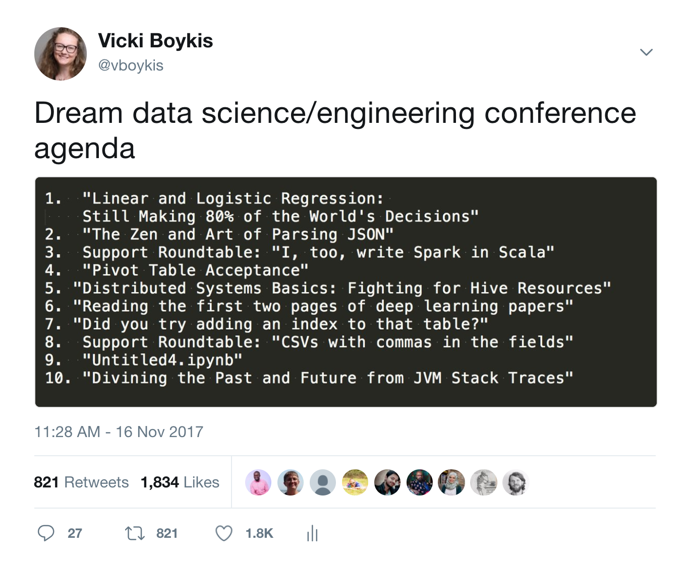

slidenumbers: true


#[fit] :heart: _**Sense**_  and _**Sensibility**_ in Data Science :heart:
### Vicki Boykis | CapTech Consulting | Twitter: @vboykis


---

## _**About me**_



---
### _**Agenda**_


### 1. Hype problems in data
### 2. Real problems in data
### 3. How to connect the two 
 
---
#Passion is inversely proportional to the amount of real information available.
#- Benford’s Law


---

# [fit] Things we worry about but shouldn’t


#  **_1. The end of human decision-making_**
#  **_2. Self-driving cars_**
#  **_3. robots killing us all_**


---
`autoscale: true`
# Hype/fear: Machine learning will take over decision making



+ [MarketWatch](https://www.marketwatch.com/story/this-chart-spells-out-in-black-and-white-just-how-many-jobs-will-be-lost-to-robots-2017-05-31?mg=prod/accounts-mw)
: 
	- [Over half](https://www.oxfordmartin.ox.ac.uk/downloads/academic/The_Future_of_Employment.pdf) of all jobs today in 10-20 years “ will be automated away 	
	- Retail, Hand Laborers and Material Movers, Truck Drivers

- " [In the US alone](https://www.theverge.com/2017/11/30/16719092/automation-robots-jobs-global-800-million-forecast), between 39 and 73 million jobs stand to be automated — making up around a third of the total workforce."


---

# The reality: The hard problems are still people problems 


+ [Digital Apollo](https://mitpress.mit.edu/books/digital-apollo)
	"As Apollo 11's Lunar Module descended toward the moon under automatic control, a program alarm in the guidance computer's software nearly caused a mission abort. Neil Armstrong responded by switching off the automatic mode and taking direct control."

+ [GrubHub](https://www.wired.com/story/how-grubhub-analyzed-4000-dishes-to-predict-your-next-order/)
	+ "HOW GRUBHUB ANALYZED 4,000 DISHES TO PREDICT YOUR NEXT ORDER" 
	+ "In the parlance of a data scientists, food is an unstructured domain. Grubhub had 14 million menu items and the only thing they had in common was that sometimes people ate them. So Belousova’s team set out to build its own taxonomy of food."
 	+ Schreiber created a cuisine dictionary for the data team that broke down the ingredients in many of the dishes, an internal document that included names of cuisines, history, sometimes maps to show the geographic relationships. She built decks to explain to the data scientists dishes that didn’t have obvious names.

https://www.racked.com/2018/4/17/17219166/fashion-style-algorithm-amazon-echo-look

---

#[fit] The reality: The hard problems are still people problems 





---
# Hype/fear: Self-Driving Cars will solve all of our transportation problems

+ Chinese company Ehang: "People are now flying around in autonomous drones"
+ [Slate:](https://slate.com/technology/2018/05/who-will-clean-self-driving-cars.html) Who will clean self-driving cars? 
+ [Elon Musk:](https://www.ted.com/talks/elon_musk_the_future_we_re_building_and_boring) We are two years away from sleeping in our cars

---

# The reality: 

+ We still [don't have enough data](https://devblogs.nvidia.com/training-self-driving-vehicles-challenge-scale/
)
```
50 epochs * 104 TB of data / 19 MB/s = 9.1 years to train an Inception-v3-like network once.
6.2 years for a ResNet-50-like network.
1.2 years for an AlexNet-like network.
```

---

# [fit]The reality 


---
# Hype/fear: Robots will kill us

+ [Wozniak:](https://www.theguardian.com/technology/2015/jun/25/apple-co-founder-steve-wozniak-says-humans-will-be-robots-pets)) "Apple co-founder Steve Wozniak says humans will be robots' pets"

---

# The reality: The hard problems are still people problems 


---

# Maslow's Hierarchy of Data Needs



---

# So what are the real problems in machine learning and data? 



https://blog.openai.com/ai-and-compute/?

---

# [fit] Real problems
# [fit] **_1. Moving and working with data in the cloud_**
# [fit] **_2. Keeping Data Secure_**
# [fit] **_3.Interpreting Models_**

---

#[fit] Problem: You are a medium-sized retailer 
#[fit]  that has been doing well in brick and mortar sales 
#[fit]  but now wants to fix everything with AI. 

---


---

How Harry will work: 


---

# [fit] Problem: :cloud: Moving and working with Data to the Cloud:cloud:

1. You've been doing great 

Business ask: 

Steps work backwards   

 + 3/4 of my last clients have involved at least some cloud movement component
+ 100 % of those have involved ETL moves 
+ the average time before respondents thought their IT budgets would be 80% cloud-based 
was 15 months[http://usdatavault.com/library/Building-Trust-in-a-Cloudy-Sky.pdf]

+ 41% of workloads are run in the cloud
+ [Cloud computing spending](https://www.forbes.com/sites/louiscolumbus/2017/04/29/roundup-of-cloud-computing-forecasts-2017/#3b5c01fc31e8
) is growing at 4.5 times the rate of IT spending since 2009 and is expected to grow at better than 6 times the rate of IT spending from 2015 through 2020.
+ But all of the data is still in Oracle 

+ 


https://www.snaplogic.com/blog/get-your-game-plan-on-data-warehouse-migration-to-the-cloud-2


---

Examples of problems moving to the cloud

+ Schema migration
+ Metadata migration
+ Estimating costs
+ Analysts now become developers
+ Skills shortage

---

# Problem: Keeping Data Secure

You have customer preferences, a

+ https://www.upguard.com/breaches/the-rnc-files
+ https://www.scmagazine.com/open-aws-s3-bucket-exposes-private-info-on-thousands-of-fedex-customers/article/744812/
+ GDPR Regulations 

---

# [fit] Add _**[fit]**_ 

---

# [fit] To the start
# [fit] of any headline

---

# [fit] _**(After the hash & before the headline)**_
# [fit] _**Like so:**_ `# [fit] Your awesome headline`

---

# [fit] **_2_**

---

# [fit] Only 
# [fit] use Headlines
# [fit] _**Start it with a # — no Paragraphs or lists within your slide**_

---

# [fit] Solutions

---

# [fit] Go forth and create:

---

# [fit] Impact

---

# [fit] &

---

# [fit] Focus

---

# [fit] :heart: Thank you!:heart:
#[fit] Vicki Boykis | CapTech Consulting | Twitter: @vboykis


